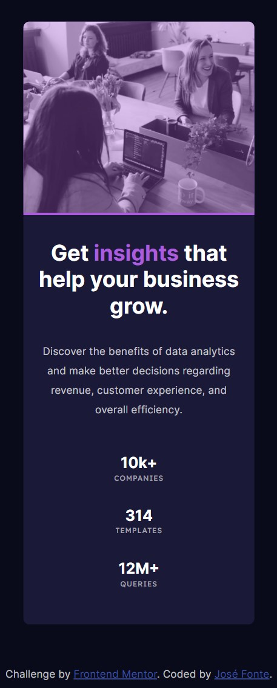

# Frontend Mentor - Stats preview card component Challenge
## Welcome! 👋

This repository has my solution to a challenge on <a href="http://frontendmentor.io" target="_blank">Frontend Mentor</a>.
To build this I used HTML & CSS.
## Model Given
### Desktop Version 

## My solution!
### Desktop Version

### Mobile Version

## In Action 🎥

### Things I practiced
- Flexbox 
- Background colors and images
- Importing fonts
- Responsive design implementation
- Building following a given design and its design marks

**Thanks for checking this out !** 🦧
